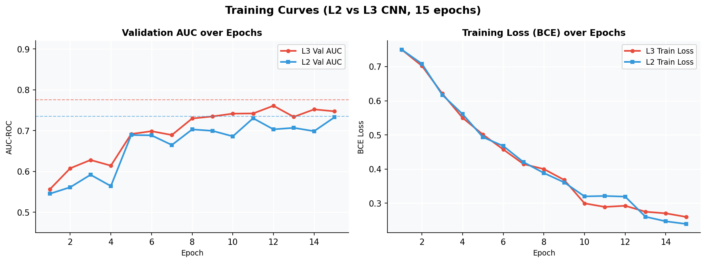
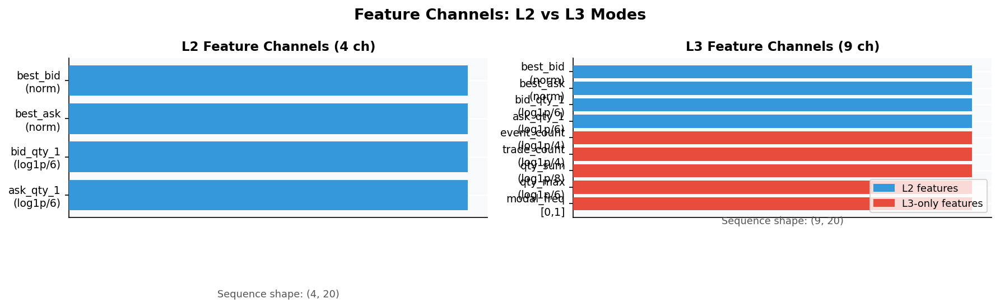
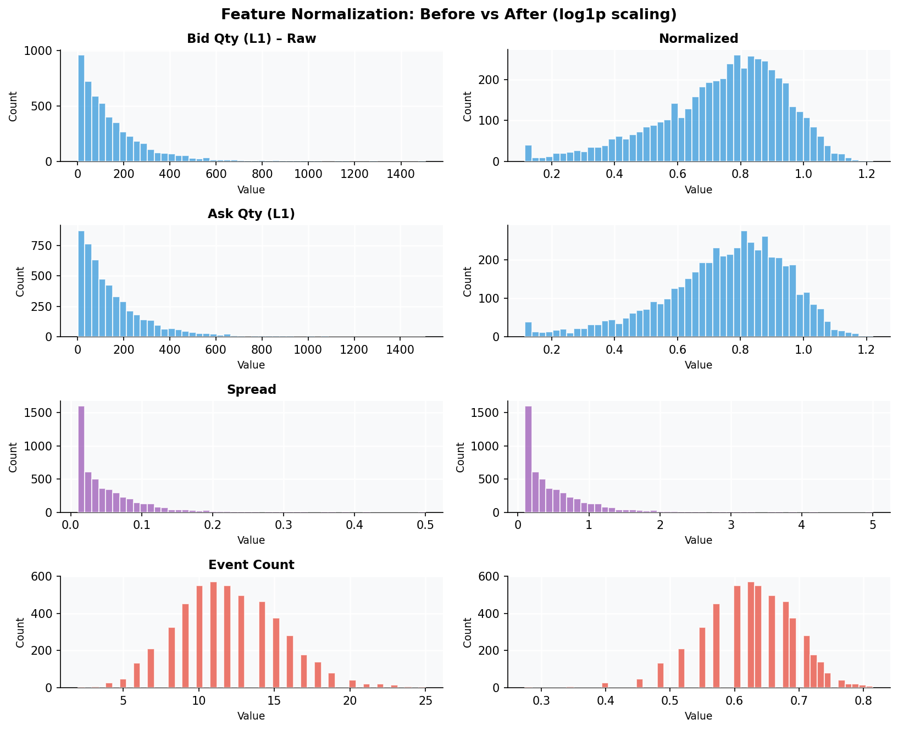
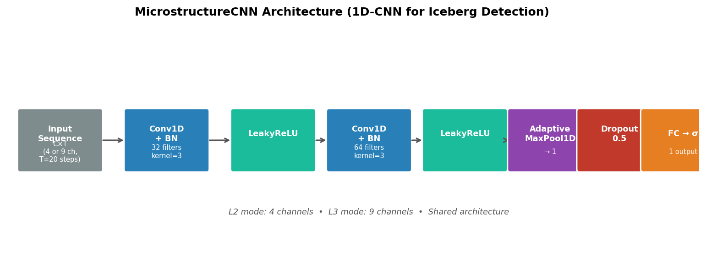
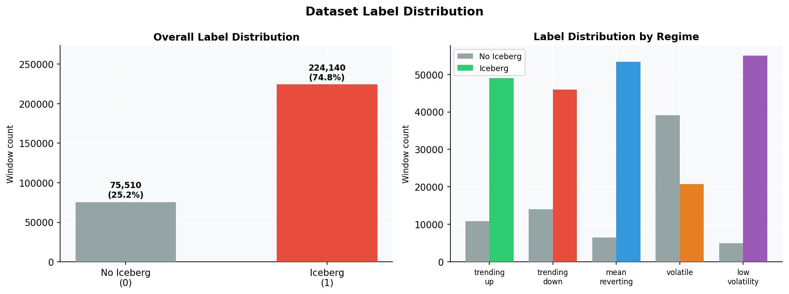
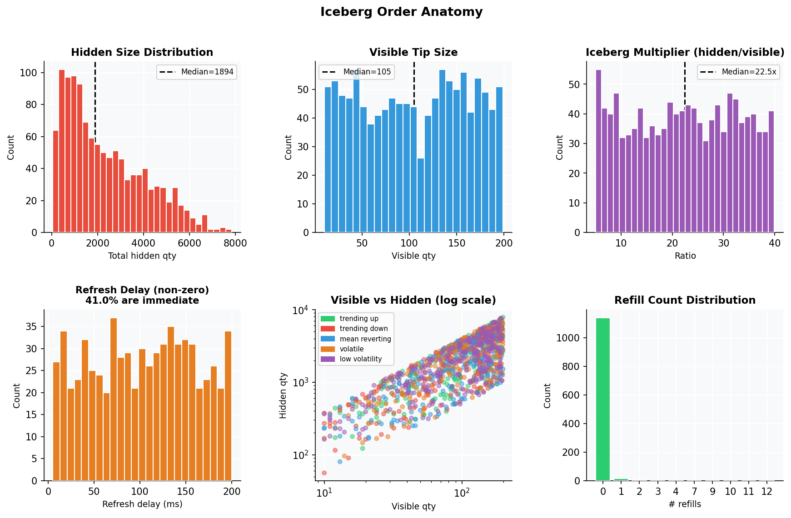
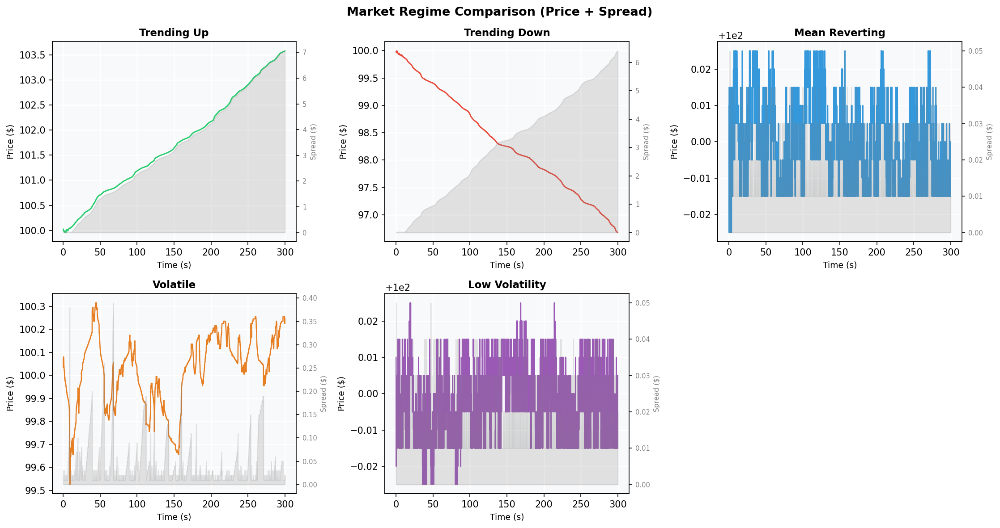
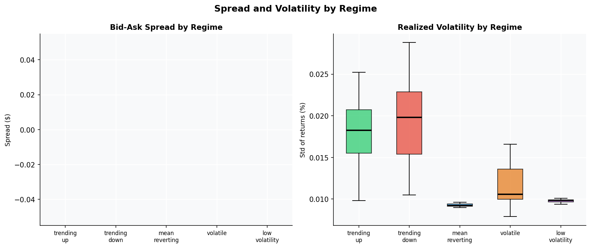

# Iceberg Order Detection

A end-to-end pipeline for detecting **iceberg orders** — large institutional orders hidden behind small visible tips — using only observable limit order book (LOB) dynamics. Built on a synthetic market simulator with injected ground-truth icebergs, trained with a 1D-CNN on microstructure sequences.

---

## Results

| Model | AUC-ROC | Avg Precision | Test samples |
|-------|---------|---------------|--------------|
| **L3 CNN** (price + order flow) | **0.8900** | **0.8787** | 179,190 |
| **L2 CNN** (price + qty only) | **0.8298** | **0.8499** | 179,190 |
| L3 → L2 degradation | −6.8% | — | — |

<table>
<tr>
<td></td>
<td></td>
</tr>
<tr>
<td align="center"><em>L2 vs L3 AUC & Average Precision</em></td>
<td align="center"><em>Training curves over 5 epochs</em></td>
</tr>
</table>

---

## How It Works

### 1 — Synthetic Market Simulation

A discrete-event limit order book simulator runs 5 market regimes (trending up/down, mean-reverting, volatile, low-volatility), each with realistic buy/sell agents. Iceberg orders are injected at random intervals at the best bid/ask with controlled hidden size (5–40× the visible tip) and refresh delay (0–200 ms).

```
parent order:   10,000 shares hidden
visible tip:       100 shares in book  ← only this is observable
on fill:           auto-refill → next 100 appear
repeat until:   all 10,000 shares exhausted
```

Because we inject the icebergs ourselves, every window has a **ground-truth label**.

### 2 — Feature Extraction

Each 1-second window (20 × 50 ms snapshots) is converted to a multi-channel time series fed directly to the CNN. Two feature sets are compared:



**L2 mode** (4 channels): best bid, best ask (spread-normalized), bid L1 qty, ask L1 qty (log1p-scaled).

**L3 mode** (9 channels): L2 features + event count, trade count, qty sum, qty max, modal quantity frequency — all aggregated from raw order/trade events into the same 50 ms bins.



### 3 — 1D-CNN Classifier

```
Input (C × 20)  →  Conv1D-32 → BN → LeakyReLU
                →  Conv1D-64 → BN → LeakyReLU
                →  AdaptiveMaxPool1D(1)
                →  Dropout(0.5)
                →  FC → σ  →  P(iceberg)
```



Trained with BCE loss, Adam optimizer, 5 epochs on 215k balanced (50/50) windows. Best checkpoint selected by validation AUC.

---

## Dataset

<table>
<tr>
<td></td>
<td></td>
</tr>
<tr>
<td align="center"><em>Label distribution by regime</em></td>
<td align="center"><em>Iceberg order anatomy</em></td>
</tr>
</table>

- **5 regimes** × 20 runs × 300 s/run = 100 simulated trading sessions
- **562 iceberg chains** injected across all sessions
- **299,650 labelled windows** (0.3 s window, 0.05 s step)
- Hidden size: 73–7,839 shares (median 1,920); visible tip: 10–199 shares (median 102); multiplier: 5–40×
- 40% of icebergs refresh immediately; 60% with 5–200 ms stochastic delay

---

## Market Regimes

<table>
<tr>
<td></td>
<td></td>
</tr>
<tr>
<td align="center"><em>Price & spread traces per regime</em></td>
<td align="center"><em>Spread and realized volatility by regime</em></td>
</tr>
</table>

| Regime | Volatility | Drift | Mean-rev | Order rate |
|--------|-----------|-------|----------|------------|
| trending_up | 0.04% | +0.03% | 0.0 | 200/s |
| trending_down | 0.04% | −0.03% | 0.0 | 200/s |
| mean_reverting | 0.02% | 0 | 0.6 | 150/s |
| volatile | 0.12% | 0 | 0.1 | 300/s |
| low_volatility | 0.01% | 0 | 0.4 | 100/s |

---

## Iceberg Signal


Price and L1 quantity around a real multi-refill iceberg in the volatile regime. The ask quantity (red) holds abnormally steady while the bid quantity drops — the signature the CNN learns to detect.

---

## Project Structure

```
iceberg-detection/
├── core/                        # Simulator engine
│   ├── order.py                 # LimitOrder, MarketOrder, NaiveIcebergOrder
│   ├── order_book.py            # Price-time priority two-sided book
│   ├── matching_engine.py       # Trade generation & iceberg refill
│   ├── event_queue.py           # Discrete-event scheduler
│   └── market_simulator.py      # Main orchestrator
│
├── training/
│   ├── config.py                # IcebergConfig, RegimeConfig, ModelConfig
│   ├── data_generator.py        # RegimeSimRunner, IcebergOrchestrator, DatasetBuilder
│   ├── agents.py                # BuyAgent / SellAgent (Gaussian limit orders)
│   ├── feature_extractor.py     # Sliding-window label generation & CNN sequences
│   ├── model_cnn.py             # MicrostructureCNN, MicrostructureDataset, train loop
│   ├── model_trainer.py         # run_full_experiment (L2 + L3 pipeline)
│   ├── run_experiment.py        # CLI entrypoint
│   ├── data/                    # Parquet datasets (generated)
│   ├── models/                  # Saved checkpoints & degradation_report.json
│   └── plots/                   # All visualizations
│
└── visualize.py                 # Regenerate all plots
```

---

## Quickstart

```bash
python -m venv .venv && source .venv/bin/activate
pip install -r requirements.txt

# Full pipeline: simulate → label → train
python training/run_experiment.py --stage all

# Individual stages
python training/run_experiment.py --stage generate --runs-per-regime 20 --sim-duration 300
python training/run_experiment.py --stage features
python training/run_experiment.py --stage train

# Regenerate plots
python visualize.py
```

**Requirements:** `numpy`, `pandas`, `scikit-learn`, `torch`, `joblib`, `matplotlib`, `sortedcontainers`

Hardware: runs on CPU, MPS (Apple Silicon), or CUDA. Full training on ~215k samples takes ~1 minute on MPS.

---

## Statistical Significance

The L3 vs L2 AUC gap is statistically significant under three tests (n = 5,000 balanced held-out samples each):

| Test | Result |
|------|--------|
| 95% bootstrap CI on delta | [+0.055, +0.088] — excludes zero |
| Permutation test p-value | < 0.0001 |
| Hanley-McNeil z-test | z = 8.11, p = 4.4 × 10⁻¹⁶ |

The L3 advantage is real: raw order-flow features (event counts, trade counts, volume clustering) carry information about iceberg presence that bid/ask prices and L1 quantities alone do not.
