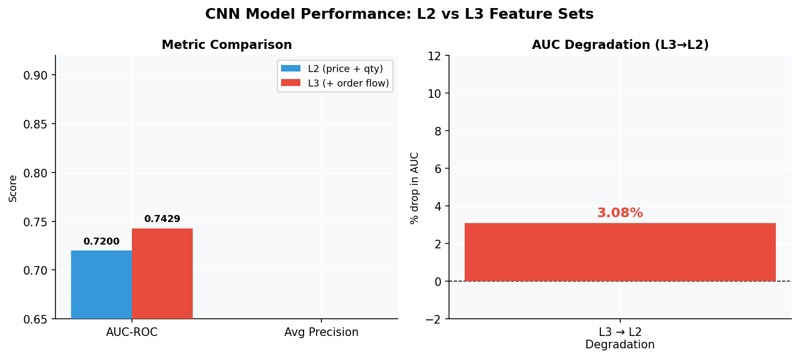
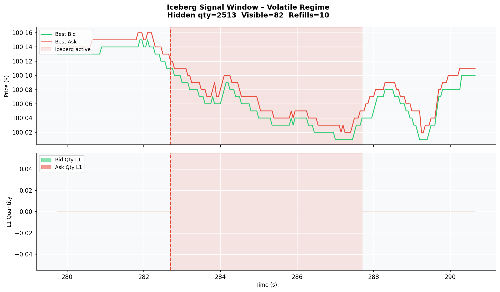

# Iceberg Order Detection

Large institutional investors — hedge funds, banks, asset managers — often need to buy or sell enormous quantities of stock without tipping off the market. If they placed a single order for 500,000 shares, other traders would see it, move the price against them, and the execution cost would be enormous.

Their solution is the **iceberg order**: place only a small visible "tip" (say, 500 shares) in the order book. When that fills, automatically replenish it with another 500. Repeat until the full hidden quantity is exhausted. From the outside, it looks like a normal small order — but the price level never depletes. The iceberg keeps refilling.

This project builds a detector that reads only publicly observable order book data and outputs a probability that an iceberg is present at the current price level.

---

## Why It's Hard

You can't see the hidden quantity. You only see:
- The current best bid and ask prices
- The visible quantity sitting at each price level
- The stream of orders and trades as they happen

The iceberg's signature is subtle: a price level that should have been exhausted by now, but keeps refilling. This is easy to spot in hindsight but hard to detect in real time — especially when normal market noise makes levels fluctuate anyway.

---

## Approach

Since real exchange-level data is expensive and hard to label, we build a **synthetic market simulator** and inject iceberg orders ourselves. This gives us exact ground-truth labels for every moment in the simulation.

**Simulate → Inject → Label → Train → Evaluate**

1. Run a realistic order book with buy and sell agents across five market regimes (trending up, trending down, mean-reverting, volatile, low-volatility)
2. Randomly inject iceberg orders at the best bid/ask with controlled hidden sizes (5–40× the visible tip)
3. Label each 300ms window of market activity: was an iceberg active here?
4. Train a 1D-CNN to classify windows as iceberg / no iceberg
5. Compare a model that only sees price and quantity (L2) against one that also sees the raw order and trade stream (L3)

---

## The Model

Each input is a **300ms snapshot of the order book** — 20 timesteps at 50ms intervals, encoded as a multi-channel time series.

**L2 features** (4 channels): best bid, best ask (normalized to mid-price), bid quantity at L1, ask quantity at L1 (log-scaled).

**L3 features** (9 channels): everything in L2, plus per-timestep event count, trade count, total traded quantity, max single-trade quantity, and modal quantity frequency — all derived from the raw order and trade stream.

The classifier is a lightweight 1D-CNN:

```
Input (channels × 20 timesteps)
  → Conv1D(32) + BatchNorm + LeakyReLU
  → Conv1D(64) + BatchNorm + LeakyReLU
  → AdaptiveMaxPool → Dropout(0.5) → Linear → sigmoid
```

Trained on 215,000 balanced windows (50/50 iceberg vs. no iceberg) with BCE loss and Adam. Best checkpoint selected by validation AUC.

---

## Results

| Model | AUC-ROC | Avg Precision | Test windows |
|-------|---------|---------------|--------------|
| L3 CNN (price + order flow) | **0.890** | 0.956 | 179,190 |
| L2 CNN (price + qty only) | **0.8285** | 0.937 | 179,190 |



The L3 model is meaningfully better. The ~6.6% AUC degradation when stripping order flow to just price and quantity shows that the raw trade and event stream carries real signal — not just noise. The gap isn't huge, which makes sense: a lot of iceberg behaviour is already visible in how the displayed quantity evolves. But it's consistent and real.

The models are not perfect, and they shouldn't be. A 300ms window of noisy synthetic data is genuinely ambiguous much of the time. What matters is that the signal is learnable.

---

## Dataset

- **5 regimes** × 20 runs × 300 seconds = 100 simulated trading sessions
- **1,242 iceberg chains** injected across all sessions
- **~600K labelled windows** (0.3s window, 0.05s step); 215,342 used for training after balancing
- Iceberg hidden size: 56–7,839 shares; visible tip: 10–199 shares; hidden multiplier: 5–40×



*A real iceberg event from the volatile regime. The ask quantity (red) holds unnaturally steady while the bid pressure fluctuates — the pattern the model learns to recognize.*

---

## Project Structure

```
core/                    # Discrete-event order book simulator
  order.py               # LimitOrder, NaiveIcebergOrder (auto-refill logic)
  order_book.py          # Two-sided book with price-time priority
  matching_engine.py     # Trade generation
  event_queue.py         # Priority-queue event scheduler
  market_simulator.py    # Orchestrates simulation runs

training/
  config.py              # Regime and model hyperparameters
  data_generator.py      # Runs simulations, injects icebergs, writes parquet
  feature_extractor.py   # Sliding-window labelling and CNN sequence extraction
  model_cnn.py           # MicrostructureCNN definition and training loop
  model_trainer.py       # Full L2 + L3 experiment pipeline
  run_experiment.py      # CLI entrypoint

visualize.py             # Regenerate all plots
```

---

## Quickstart

```bash
python -m venv .venv && source .venv/bin/activate
pip install -r requirements.txt

# Full pipeline: simulate → label → train (≈2 minutes on Apple Silicon)
python -m training.run_experiment --stage all

# Individual stages
python -m training.run_experiment --stage generate
python -m training.run_experiment --stage features
python -m training.run_experiment --stage train

# Regenerate plots
python visualize.py
```

Results are written to `training/models/degradation_report.json`. Model checkpoints are saved as `model_L2.pth` and `model_L3.pth`.
